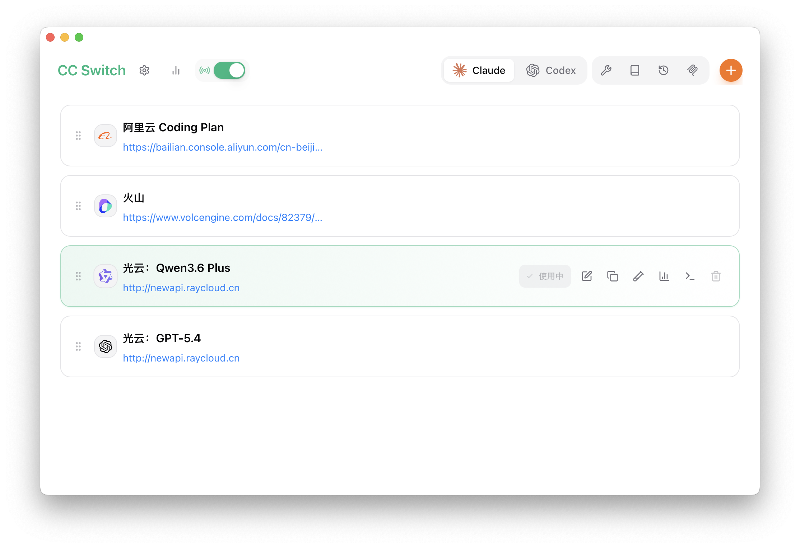
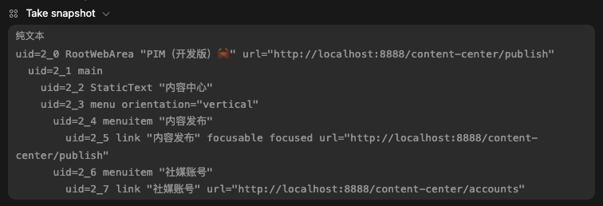

# AI Share

## AI 编程进化路线图

### 阶段一：代码补全时代

- 工具代表：主要以 VS Code 的插件形态存在，如 Tabnine、Github Copilot。
- 核心特征：按 Tab 键接受代码建议。它是一个单向的、基于概率的字符串拼接机器。
- 人类角色：开发工程师。（我们需要对代码仓库有完整的架构理解，AI 仅仅只是帮我们省了敲键盘的力气。）
- 应用场景：输入关键词 `function debounce(` ，AI 自动补全函数。
- 功能局限：典型的「瞎子摸象」，AI 缺少对全局的理解，只理解鼠标光标前后几行代码，能力存在很大的局限性。

从「原始编程时代」进入「AI 编程时代」，第一次感受到大模型带来的震撼。时常会感受到“woc！AI 好懂我”。当时也根本没想过 AI 编程会发展成什么样子。

### 阶段 2：对话副驾驶时代

- 工具代表：VS Code 插件，或独立的 IDE，如 Trae、Cursor。
- 核心特征：打破了单文件的限制，AI 开始拥有项目级的工程视野；开始结合 MCP、Skills的应用；想要实现较好的 AI 生成效果，可能要写好提示词。
- 应用场景：把报错信息粘贴进去让其自行分析问题，解决 BUG；在对话框中描述需求文档、引入关键代码行或文件、插入图片，让 AI 实现功能。
- 人类角色：开发工程师 ➕ 代码审查员。
- 功能局限：小心翼翼的探索 AI 编码的能力上限，不敢布置很有难度、需要很多上下文的任务，AI 生成代码之后需要认真审查，大概率还需要手动调整生成的代码。

该阶段实际体验：使用国内版的 Trae，用的内置的免费的字节自家的大模型，生成的代码多多少少都有要调整的地方，这导致我对 AI 编程能力的信心不强，基本每次生成的代码都要 review。

### 阶段 3：智能体工作流时代

AI Coding Agent 即 AI 编码智能体

- 进入阶段 3 的背景：大模型支持的上下文越来越大，专业能力越来越强，价格也便宜了很多；主流模型基本都支持多模态。
- 工具代表：Claude Code、Codex、OpenCode。
- 核心特征：从「被动响应」变成了「自主行动」，可以为了完成任务去主动调用各种工具、翻阅各种文档，并且会有意识的走完计划、实施、验证这个完整的过程。

#### 这一阶段最值得单独展开的应用场景

和前两个阶段相比，这里的重点已经不是“帮我生成一段代码”，而是“围绕一个目标，把完整闭环走完”。这也是我在演讲时会单独展开讲的部分。

- **描述 BUG 复现方式，智能体自动在浏览器中操作、修改关键代码、验证结果。**
- **给它一篇 Markdown 或一份长文档，让智能体自动生成 PPT，并统一样式和排版。**
- **让智能体打开浏览器，截图网页在亮色 / 暗色和 PC / 移动端 的实际渲染效果，设计出更好看的 UI，并保持在各个场景中遵循同一套设计语言。**
- **基于项目架构和已有国际化体系，把一篇中文文档或一批页面文案翻译成其他语言，并落到对应代码里。**
- **从上证所批量获取股票数据，生成精美的、动态的股票分析报告。** 
- **给智能体一份 PRD，让其自动完成功能。**

这些场景之所以重要，是因为它们最能体现智能体和前两个阶段的本质区别：它不再只是“给建议”或“补几行代码”，而是真的开始执行任务、调用工具，并对结果负责。

我接触的第一个编程智能体是 OpenCode，倒不是因为它本身怎样，而是在 X 上看到了很多人在分享的插件 `oh-my-opencode` 。

### oh-my-opencode

一款搭配 OpenCode 使用的多模型智能体编排框架。

它内置了多个专职智能体（相当于 Claude Code 中的 subagents）：

- **Sisyphus（西西弗斯）**：主架构师，负责把控全局和任务拆解。
- **Librarian（图书管理员）**：负责看文档、搜寻上下文。
- **Oracle（神谕）**：负责 Code Review，只挑刺不写代码。
- **Frontend Engineer**：专门负责切图和 UI 还原。

它是受 Claude Code 启发的开源集大成者，但是它允许不同的智能体使用不同的模型：

- 主架构师西西弗斯使用最强最新的 GPT、Claude 的旗舰模型。
- 图书管理员使用便宜有好用的 Kimi K2.5。
- 前端开发工程师使用擅长视觉擅长前端的 Gemini 模型。

它的爆火原因：

1. 被 Anthropic 点名封杀
2. 不同的模型做不同的任务，节省花费
3. 开箱即用，它内置了一系列好用的 MCP、Skills、提示词，还有 LPS/AST 工具链

## CC Switch

配置智能体的超实用必备应用。



- 集中管理供应商、MCP、Skills、提示词
- API 代理格式转换、故障转移
- 配置导入、导出、备份、同步

## MCP / Skills

MCP 是 AI 的「手和脚」，决定 AI 能接触到什么、能操作什么，它是动态的、可执行的；Skills 是 AI 的「脑回路和专业知识」，决定 AI 如何思考，以什么风格做事，它是静态的、约束性的、说明性的。

### MCP

MCP 是个标准的CS通信协议，它允许智能体（C）向外部环境（S）请求数据或执行动作。它是双向的。

### chrome-devtools-mcp

chrome-devtools-mcp 让大模型通过 MCP 与 Chrome Devtools Protocol（CDP）通信。

CDM 给了智能体像人一样观察网页、理解网页、操作网页的能力，并且是以效率高，完全使用真实的用户浏览器，还能直接获取到 Console 和 Network 面板数据。

鉴于日后的智能体使用过程中，无论是网页开发还是自动化操作，我相信 chrome-devtools-mcp 都会经常出现，所以着重介绍下它。以下简称 CDM。

#### Take snapshot



调用 CDP 提供的 `DOMSnapshot.captureSnapshot` ，它将 HTML 中冗长的、复杂的 DOM 树，压缩成极其精简的语义树。它返回的全是对 AI 决策既精简又使用的信息。

比如 AI 决定点击某个按钮，只需要返回指令：

```jsx
{
  "server": "chrome-devtools",
  "tool": "click",
  "arguments": {
    "uid": "10_34",  // 元素的 uid
    "includeSnapshot": true  // 执行成功后再次返回快照
  }
}
```

#### Take screenshot

调用 CDP 中的 `captureScreenshot` ，获取当前视窗的截图、特定 DOM 元素的截图、整张网页的截图。

#### Emulate

模拟移动端还是 PC 端，模拟黑暗/明亮模式，模拟网络限制。

#### Evaluate Script

跑任意 JavaScript 代码。获取任意数据，获取组件实例、DOM 对象、Window 对象的引用，拦截网络请求，批量操作节点。

### 对前端开发很实用的其他 MCP 例子

- `filesystem`：读取项目源码、配置文件、路由、样式文件、i18n 文案，适合跨文件理解和批量修改。
- `fetch`：抓官方文档、API 文档、报错说明和兼容性资料。前端生态变化快，这类 MCP 的实用性很高。
- `git`：查看提交记录、diff 和历史上下文，适合理解“这段代码为什么这样写”，也适合做 Code Review。
- `Figma MCP`：把设计稿里的节点信息、尺寸、颜色、文案和组件结构带进对话，帮助从设计到代码的落地。

### Skills

Skills 是高级的、结构化的上下文注入。和智能体对话唤醒一个 Skill 时，其实就是将一段预设的专家级提示词（System Prompt、Experts）、行为准则（Rules）塞进大模型的系统提示词中，它是单向的规则约束。

为什么 Skills 和 MCP 对于智能体而言缺一不可？以设计一个 UI 精美的登录页为例子：

- 只有既有 `skill: frontend-design` 又有 `mcp: chrome-devtools-mcp` ，智能体才懂得按什么样的规则去设计一个好看的页面，并且在浏览器里截图验证、微调、验证，最终得到满意的结果。
- 如果只有 Skills 没有 MCP，设计出来的页面里单个元素看着还行，但整体依然丑陋。
- 如果没有 Skills 只有 MCP，智能体就不知道如何去设计好看的页面。
- 如果没有 Skills 也没有 MCP，那设计出来的页面会非常的原始，毫无任何设计可言。

### 对前端开发很实用的 Skills 例子

- `frontend-design`：在你已经有需求或页面草图时，给 AI 一套更明确的设计规则，避免产出“默认味很重”的页面。
- `iconify`：统一图标接入方式，快速选择图标，并处理不同框架里的渲染方案。
- `web-design-guidelines`：检查页面的信息层级、视觉一致性、可访问性和交互细节，适合做 UI Review。
- `karpathy-guidelines`：约束 AI 编码时先思考、少乱改、重验证，尤其适合改生产代码。

## AI 编程时的基本准则

- 说出来，让我懂你
- 拆解自己的工作流程，交代给 AI
- 智能体一定要支持在线搜索
- 对话中发送图片若遇到

#### karparthy 编程四原则

| **原则** | **解决什么问题** |
| --- | --- |
| **编码前思考** | 错误假设、隐藏困惑、缺少权衡 |
| **简洁优先** | 过度复杂、臃肿抽象 |
| **精准修改** | 无关编辑、触碰不应碰的代码 |
| **目标驱动执行** | 通过测试优先、可验证的成功标准 |

##### 1. 编码前先思考

- **不要假设、妄下断言。不要隐藏困惑。坦诚地权衡利弊。**
- 明确陈述假设。
- 若存在多种解释请提出，不要默默做选择。
- 若有更简单的方法请提出。
- 必要时坚持己见。
- 如有疑问请提出。

##### 1. 简单优先

- **用最少的代码解决问题。不要进行任何推测。**
- 没有超出要求的功能。
- 不为一次性代码进行抽象。
- 没有提供任何未要求的“灵活性”或“可配置性”。
- 对于不可能出现的情况，不进行错误处理。
- 如果你写了 200 行，而 50 行就可以写完，那就重写。

检验标准：资深工程师会认为这过于复杂吗？如果是，简化它。

##### 1. 精准修改

**只碰你必须碰的东西。只清理自己造成的混乱。**

改动现有文件时：

- 不要“改进”相邻的代码、注释或格式。
- 不要重构没有问题的代码。
- 即使你的做法不同，也要保持与现有风格一致。
- 如果你发现无关的死代码，请指出来——不要删除它。

当你创建了孤立文件时：

- 删除因您的修改而不再使用的导入项/变量/函数。
- 除非被要求，否则不要删除已有的无效代码。

测试要求：每一行修改后的代码都应该直接追溯到用户的请求。

##### 1. 目标驱动执行

**定义成功标准。循环验证直至通过。**

将指令式任务转化为可验证的目标：

| **不要这样做...** | **转化为...** |
| --- | --- |
| "添加验证" | "为无效输入编写测试，然后让它们通过" |
| "修复 bug" | "编写重现 bug 的测试，然后让它通过" |
| "重构 X" | "确保重构前后测试都能通过" |

对于多步骤任务，说明一个简短的计划：

```
1. [步骤] → 验证 → [检查]
2. [步骤] → 验证 → [检查]
3. ...
```

强有力的成功标准让 LLM 能够独立循环执行。弱标准（"让它工作"）需要不断澄清。

来自 Andrej karpathy：

> "LLM 非常擅长循环执行直到达成特定目标……不要告诉它该做什么，给它成功标准，然后看着它完成。"

> "目标驱动执行"原则正是捕捉了这一点：将指令式指令转化为带有验证循环的声明式目标。

**如何判断它在起作用**

- **diff 中不必要的改动更少** —— 只有请求的改动出现
- **因过度复杂而导致的重写更少** —— 代码第一次就写得简洁
- **澄清问题在实现之前提出** —— 而不是在犯错之后
- **干净、精简的 PR** —— 没有顺带的重构或"改进"

## 杂谈

- 用了智能体之后，再次有了刚接触编程时的兴奋感，有很多很有意思的想法可以实现
- 大学时人生三大目标：精通一门编程语言、精通一款编曲软件、精通一款图像编辑软件，如见看来我只需要精通使用 AI 即可
- 掌握如何用好 AI 的技能就是掌握了一个及其强大又非常通用的技能
- 训练批判性思维。学会评估论点、发现缺口、质疑假设。学会好设计长什么样。这些技能会复利。
- 工程师的价值正在从代码产出转向决策质量。快速写代码的能力每个月都在贬值，评估、批评和引导 AI 的能力在升值。
- LLM 就像掌握了很多数学定理的学生，但是刷题较少，遇到一个复杂的数学题不知道如何组合使用这些定理。而智能体就相当于给学生一点点提示，告诉它在每一步可以使用哪个定理最终解决问题。
- AI 编码代理默认选择最短路径——这通常意味着跳过规范、测试、安全审查以及其他确保软件可靠性的实践。Agent Skills 为代理提供结构化的工作流程，使其能够像高级工程师在生产代码中那样，严格遵守这些流程。

## 参考资料

- [https://github.com/forrestchang/andrej-karpathy-skills/blob/main/README.zh.md](https://github.com/forrestchang/andrej-karpathy-skills/blob/main/README.zh.md)
- [https://mp.weixin.qq.com/s/wPtZ7zqZb3Ce9yn4HoO-rQ](https://mp.weixin.qq.com/s/wPtZ7zqZb3Ce9yn4HoO-rQ)
- [https://github.com/addyosmani/agent-skills](https://github.com/addyosmani/agent-skills)
